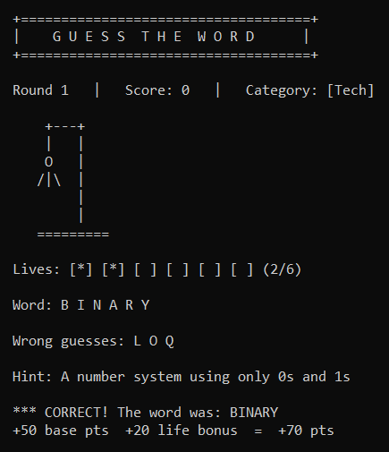

# Guess The Word 🎯

A console-based word-guessing game built in C++17. Guess the hidden word 
letter by letter before the hangman is complete. Features categories, 
hints, scoring, and ASCII art gallows.


---

## Features

- 20-word bank spanning 4 categories: Tech, Science, Nature, General
- 6-stage ASCII art gallows rendered live as lives are lost
- Category tag shown each round so you know the domain
- Optional hint reveal at the cost of 1 life
- Life-bonus scoring: +50 pts for guessing correctly, +10 pts per 
  remaining life
- Shuffle ensures no word repeats until the full pool 
  is exhausted
- Play multiple rounds in a single session with cumulative score tracking

---

## How to run

**Compile:**
```bash
g++ -std=c++17 -o guess_the_word Guess_The_Word.cpp
```

**Run:**
```bash
./guess_the_word
```

Requires a C++17-compatible compiler (GCC 7+, Clang 5+, MSVC 2017+).

---
